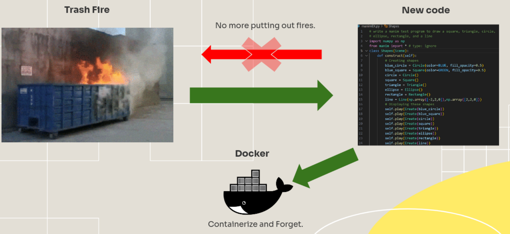

<!DOCTYPE html>
<html lang="en">
<head>
  <meta charset="UTF-8" />
</head>
<body>

<!-- Improved compatibility of back to top link -->

<!-- Shields -->

  
  
  
  
  

<!-- Project Title -->

  
  <h3 align="center">TDC001-Docker</h3>
  

    Containerized <strong>FastAPI</strong> back-end + <strong>PyQt6</strong> GUI for the Thorlabs TDC001 stepper controller – designed to be easily <em>re-skinned</em> for any future lab hardware. 
    <a href="https://github.com/JacobGitz/TDC001-Docker/issues">Report Bug</a>
    &middot;
    <a href="https://github.com/JacobGitz/TDC001-Docker/issues">Request Feature</a>
  

<!-- TOC -->
<h2>📑 Table of Contents</h2>
<ul>
  <li><a href="#about-the-project">About The Project</a></li>
  <li><a href="#built-with">Built With</a></li>
  <li><a href="#getting-started">Getting Started</a></li>
  <li><a href="#usage">Usage</a></li>
  <li><a href="#screenshots">Screenshots</a></li>
  <li><a href="#roadmap">Roadmap</a></li>
  <li><a href="#troubleshooting">Troubleshooting</a></li>
  <li><a href="#development-repurposing">Development &amp; Repurposing</a></li>
  <li><a href="#contributing">Contributing</a></li>
  <li><a href="#license">License</a></li>
  <li><a href="#contact">Contact</a></li>
</ul>

<!-- ABOUT -->
<h2 id="about-the-project">📦 About The Project</h2>

Our goal is a drop-in control stack that can be cloned, rebuilt, and reused for any instrument interface in the laboratory. Each device follows the same two-part pattern: a lean FastAPI container that communicates with the USB hardware, and a lightweight PyQt6 GUI container streamed through noVNC. By swapping out the driver module and UI skin, you can command a motorized stage today, a camera tomorrow, or whatever hardware comes next – without worrying that new code will break existing setups.

Starting with the <code>main</code> branch (<strong>2025-06</strong> release), the reference implementation targets the Thorlabs TDC001 stepper controller and includes two Docker services:
 <strong>Backend (FastAPI)</strong> – a REST API (on port <code>8000</code>) that controls any attached TDC001 cube. 
<strong>Frontend (PyQt6 GUI)</strong> – a desktop-style UI rendered in a virtual X11 display and streamed via noVNC (on port <code>6080</code>).

You can run both containers on the same PC or even split them across the network. Linux hosts can access the USB device natively; Windows hosts use WSL2 + <code>usbipd-win</code> for USB passthrough; macOS can run both containers (GUI and API), but USB passthrough on Mac is not yet resolved (you will need to run the backend on a separate machine).

<strong>Relevant documentation:</strong> 
- The open-source Thorlabs APT Python driver (low-level API for the TDC001) – see the <a href="https://thorlabs-apt-device.readthedocs.io/en/latest/" target="_blank" rel="noopener noreferrer">thorlabs-apt-device documentation</a>. 
- “How To Docker #1” – an introductory slide deck covering Docker usage (a PDF copy is provided in the <code>Documentation/</code> folder). <a href="https://docs.google.com/presentation/d/1g8y-PXOg5V4Ve93i1UUEbFeU9zlJ3SWcqfPgaKH4Flg/edit?usp=sharing" target="_blank" rel="noopener noreferrer">View the presentation slides</a>. 
- Thorlabs internal stepper notes (contact Jacob for access if needed).

<!-- BUILT WITH -->
<h2 id="built-with">🔧 Built With</h2>
<ul>
  <li>Python 3.13 (Docker slim base image)</li>
  <li>FastAPI + Uvicorn (backend REST API)</li>
  <li>PyQt6 / Qt 6, Xvfb, x11vnc, noVNC (frontend GUI stack)</li>
  <li>Docker &amp; Docker Compose v2</li>
  <li><code>thorlabs-apt-device</code> library (TDC001 driver)</li>
  <li>PySerial (for serial port enumeration)</li>
  <li><code>usbipd-win</code> (USB ↔ WSL2 passthrough on Windows)</li>
</ul>

<!-- GETTING STARTED -->
<h2 id="getting-started">🧪 Getting Started</h2>

<h3>Windows (WSL2) + Docker Desktop Setup</h3>
<ol>
  <li>
    Download and install <a href="https://www.docker.com/products/docker-desktop/" target="_blank" rel="noopener noreferrer">Docker Desktop</a> for Windows. During installation, enable the option for WSL2 integration.
  </li>
   
  <li>
    Open PowerShell or CMD as Administrator and install a Linux distribution for WSL2 (Fedora 42 is tested, but other distros can work as well):
    <pre><code>wsl --install -d FedoraLinux-42</code></pre>
  </li>
   
  <li>
    After installation, enable the distro in Docker Desktop: go to <strong>Settings &rarr; Resources &rarr; WSL Integration</strong> and ensure your WSL distro (e.g., <code>FedoraLinux-42</code>) is enabled.
  </li>
   
  <li>
    (Optional) Set the new distro as the default for WSL2:
    <pre><code>wsl --set-default FedoraLinux-42</code></pre>
    Now, running <code>wsl</code> with no arguments will drop you into the Fedora WSL shell by default. (Type <code>exit</code> to leave the WSL shell.)
    
<strong>Tip:</strong> With Docker integrated into WSL, you can run Docker CLI commands (e.g., <code>docker ps</code>, <code>docker run</code>) directly from the WSL terminal. See the <a href="https://docs.docker.com/reference/cli/docker/" target="_blank" rel="noopener noreferrer">Docker CLI documentation</a> for more info.

  </li>
   
  <li>
    Install <a href="https://github.com/dorssel/usbipd-win" target="_blank" rel="noopener noreferrer">usbipd-win</a> to enable USB passthrough. Then, from an elevated PowerShell or CMD, bind the TDC001's USB port to WSL:
    <pre><code>usbipd list usbipd wsl bind --busid <em>&lt;BUS-ID&gt;</em></code></pre>
    Use <code>usbipd list</code> to find the <em>BUS-ID</em> of the connected TDC001, then bind it so the Linux environment can see it.
    
<strong>Notes:</strong>

    <ul>
      <li>Binding a <strong>USB port</strong> (bus ID) is persistent across reboots (it stays bound to WSL).</li>
      <li>Attaching a specific <strong>USB device</strong> is not persistent; you must rebind it each time the device is reconnected or the system restarts.</li>
      <li>Tools like the WSL USB GUI can help automate this process (see step 6).</li>
    </ul>
  </li>
   
  <li>
    (Optional) Install a GUI helper for USB/IP such as <a href="https://gitlab.com/alelec/wsl-usb-gui" target="_blank" rel="noopener noreferrer">WSL-USB-GUI</a> to easily manage USB device attachments and auto-attach on boot. Additionally, a Git client like GitHub Desktop (which supports WSL paths) can be useful for managing the repository on Windows.
  </li>
</ol>

<h3>Fork &amp; Clone Repository and Launch Containers</h3>
<ol>
  <li>
    <strong>Fork</strong> this repository on GitHub by clicking the “Fork” button at the top of the repo page (creates your own copy under your GitHub account).
  </li>
   
  <li>
    <strong>Clone</strong> your fork to your local machine. For example, in a terminal run (replace <code>YOUR-USERNAME</code> with your GitHub username):
    <pre><code>git clone https://github.com/YOUR-USERNAME/TDC001-Docker.git</code></pre>
    Or use the <a href="https://desktop.github.com/" target="_blank" rel="noopener noreferrer">GitHub Desktop app</a> for a graphical interface.
  </li>
   
  <li>
    Make sure you have a terminal open in the project’s root directory:
    <pre><code>cd TDC001-Docker</code></pre>
  </li>
   
  <li>
    If you are on Windows, launch a WSL terminal (Fedora) in this directory by running:
    <pre><code>wsl</code></pre>
    (On Linux or macOS, you can skip this step.)
  </li>
   
  <li>
   Start the back-end and front-end containers (choose the appropriate option for your OS): 
    <ul>
      <li><strong>Linux:</strong> From a terminal, run:
        <pre><code>Linux/backend-launch.sh Linux/frontend-launch.sh</code></pre>
      </li>
      <li><strong>Windows (WSL2):</strong> In PowerShell or CMD, run the provided batch files (this will invoke Docker within WSL):
        <pre><code>Windows\backend-launch.cmd Windows\frontend-launch.cmd</code></pre>
      </li>
      <li><strong>macOS:</strong> Run the command scripts:
        <pre><code>MacOS/backend-launch.command MacOS/frontend-launch.command</code></pre>
        
<em>Note:</em> The backend container must run on a Linux/Windows host for USB support, since Docker on macOS does not support direct USB passthrough. The macOS script above will launch the GUI container locally; you should configure it to connect to a backend running on another machine. Also, these scripts can be clicked to run, but if not, you can make them executable easily with some commands. 
      </li>
    </ul>
  </li>
   
  <li>
    Open your web browser to access the interfaces:
    <ul>
      <li>API Documentation – navigate to <a href="http://localhost:8000/docs" target="_blank" rel="noopener noreferrer">http://localhost:8000/docs</a> for the interactive FastAPI docs and to test endpoints.</li>
      <li>GUI Interface – go to <a href="http://localhost:6080" target="_blank" rel="noopener noreferrer">http://localhost:6080</a> to access the noVNC viewer for the PyQt6 GUI.</li>
    </ul>
    
<strong>Tip:</strong> The launch scripts will often try to open these pages for you automatically.

  </li>
</ol>

<!-- USAGE -->
<h2 id="usage">🚀 Usage</h2>

Once your containers are up and running, you can interact with the system in a few ways:

<h3>Web API (FastAPI backend)</h3>

Use a web browser or HTTP client to explore the REST API. Navigate to the interactive API docs at <code>http://&lt;host&gt;:8000/docs</code> (if running locally, use <code>localhost</code> as <em>&lt;host&gt;</em>). This Swagger UI allows you to test the available endpoints. Key API endpoints include:

<ul>
  <li><code>GET /ports</code> – List all detected TDC001 serial ports on the server.</li>
  <li><code>POST /connect</code> – Connect to a TDC001 on a given port (JSON body: <code>{"port": "DEVICE_PORT"}</code>).</li>
  <li><code>POST /disconnect</code> – Disconnect from the currently connected controller.</li>
  <li><code>GET /status</code> – Retrieve the status of the connected device (current position, motion state, etc.).</li>
  <li><code>POST /move_rel</code> (or <code>/move_relative</code>) – Move the stepper by a relative number of steps.</li>
  <li><code>POST /move_abs</code> (or <code>/move_absolute</code>) – Move the stepper to an absolute position (in encoder counts).</li>
  <li><code>POST /home</code> – Home the device (find the mechanical zero/reference position).</li>
  <li><code>POST /identify</code> – Blink the device’s LED for identification.</li>
  <li><code>POST /stop</code> – Immediately stop any ongoing motion.</li>
  <li><code>GET /ping</code> – Health check (used by the GUI to discover available backends on the network).</li>
</ul>

Any tool that can send HTTP requests (cURL, Postman, etc.) or the provided docs UI can be used to control the device via these endpoints. The server automatically connects to the first available TDC001 at startup if one is found; otherwise, you can call <code>/connect</code> once a device is attached.

<h3>GUI (noVNC frontend)</h3>

Open a web browser to the GUI’s address (<code>http://&lt;host&gt;:6080</code>, or <code>localhost:6080</code> if local) to launch the noVNC viewer running the PyQt6 interface. The virtual desktop will show the TDC001 Controller application. Using the GUI:

<ol>
  <li>Select or enter the backend API URL. If the API is running on the same machine, <code>http://localhost:8000</code> is the default. (The GUI can also scan your local network and list any backends it finds via the <code>/ping</code> broadcast.)</li>
  <li>Choose the TDC001’s serial port from the drop-down menu (click the refresh icon if you just plugged in the device). On Linux the port will look like <code>/dev/ttyUSB0</code>; on Windows via WSL it might appear as a similar device path once forwarded.</li>
  <li>Select a <strong>Steps/mm</strong> preset that matches your stepper’s lead screw pitch (common Thorlabs T-cubes use 0.5&nbsp;mm or 1.0&nbsp;mm lead). You can also choose “Manual set…” and enter a custom steps-per-mm value if needed. This value ensures the GUI can convert step counts to millimeters for display.</li>
  <li>Use the on-screen controls to <strong>Jog</strong> (move relative), <strong>Home</strong> (return to zero), or move to an <strong>Absolute</strong> position. The GUI’s status bar will display the current position and connection status. There’s also an “Identify/Flash” button to make the controller’s LED blink for easy identification.</li>
  <li><strong>State Saving</strong> Each time you connect or move the device, the GUI saves the session state (selected backend, port, preset, and last known position) to <code>~/.tdc001_state.json</code> in your home directory. On the next launch, the GUI will offer to restore this state — it can automatically reconnect to the same backend and port, reapply your preset, and even return to the last saved position (with safety checks if the device has moved or been re-homed in the meantime). This makes it convenient to power cycle or restart the system and continue where you left off.</li>
</ol>

<h3>Command-Line Interface (CLI, without Docker)</h3>

If you prefer to run the controller without Docker or integrate it into other Python scripts, you can use the code directly on your machine. The repository includes a Python module for the TDC001. To use it standalone:

<ol>
  <li>
    Set up a Python 3.10+ environment. Create and activate a virtual environment, then install the required libraries:
    <pre><code>cd TDC001-Docker/code python3 -m venv venv source venv/bin/activate  # (Linux/Mac) venv\Scripts\activate    # (Windows) pip install -r requirements.lock</code></pre>
    (We provide a <code>requirements.lock</code> file for reproducible installations. You can also install the core dependencies manually: FastAPI, PySerial, <code>thorlabs-apt-device</code>, etc.)
  </li>
   
  <li>
    Run the controller script in interactive mode:
    <pre><code>python tdc001.py</code></pre>
    This will launch an interactive prompt where you can enter commands (<code>m</code> to move, <code>a</code> to move absolute, <code>h</code> to home, <code>i</code> to identify/flash, <code>q</code> to quit, etc.). Under the hood, this uses the <code>TDCController</code> class (which wraps the lower-level Thorlabs APT driver).
    
<em>Advanced:</em> You can also run the module directly with <code>python -m tdc001</code> to achieve the same interactive prompt.

  </li>
   
  <li>
    Use the Python API in your own code. You can import the classes/functions to integrate the controller logic elsewhere. For example:
    <pre><code>from tdc001 import TDCController, find_tdc001_ports

ports = find_tdc001_ports()
if ports:
    controller = TDCController(serial_port=ports[0])
    controller.move_relative(1024)  # move by 1024 steps
    controller.close()</code></pre>
    The <code>TDCController</code> class is designed to be beginner-friendly and heavily commented. Check out <code>tdc001.py</code> for all available methods and details.
  </li>
</ol>

⚠️ <strong>Note:</strong> If you encounter permission issues accessing the serial port on Linux, ensure your user is in the appropriate group (e.g. <code>dialout</code>) or run the Docker container with <code>--privileged</code>. Avoid using <code>sudo</code> to run Python or activate environments, as it can cause other issues. Instead, fix the underlying permission (for example, by adjusting udev rules or adding your user to the dialout group).

<!-- SCREENSHOTS -->
<h2 id="screenshots">🖼️ Screenshots</h2>

  

<em>Above: Running the CLI utility (<code>tdc001.py</code>) detects the connected TDC001 controller on a serial port.</em>

<!-- (A GIF of the GUI in action will be added here once available.) -->

<!-- ROADMAP -->
<h2 id="roadmap">🗺️ Roadmap</h2>
<ul>
  <li>[x] Dockerized CLI release (completed 2024)</li>
  <li>[x] FastAPI backend service (completed 2025-05)</li>
  <li>[x] PyQt6/noVNC GUI frontend (completed 2025-06)</li>
  <li>[ ] Cross-platform auto-installer script for easier setup</li>
  <li>[ ] Windows-only driver support (investigate Wine/Proton for Thorlabs DLLs)</li>
  <li>[ ] One-click launcher or desktop shortcut for end-users</li>
</ul>

We welcome feedback and feature requests! Please use the GitHub Issues page for any suggestions or bug reports.

<!-- TROUBLESHOOTING -->
<h2 id="troubleshooting">🧠 Troubleshooting</h2>
<table border="1">
  <tr>
    <th>Problem</th>
    <th>Solution / Advice</th>
  </tr>
  <tr>
    <td>Backend doesn’t detect the TDC001 device</td>
    <td>
      <ul>
        <li><strong>Windows:</strong> Ensure you have bound the USB device in <code>usbipd</code> (see Getting Started).</li>
        <li><strong>Linux:</strong> Make sure the Docker container is running with <code>--privileged</code>, and that the device (e.g. <code>/dev/ttyUSB0</code>) is visible inside the container. Use <code>docker logs</code> on the backend container to check for any warnings at startup.</li>
      </ul>
    </td>
  </tr>
  <tr>
    <td>GUI shows “No backend” or cannot connect</td>
    <td>
      Verify that the backend API is running and accessible at port <code>8000</code>. If the backend is on a different machine or VM, ensure that machine’s firewall allows connections on port 8000 and that both systems are on the same network. You may need to enter the backend’s IP address in the GUI’s URL field if auto-discovery doesn’t find it.
    </td>
  </tr>
  <tr>
    <td>Device moves but GUI position reads wrong</td>
    <td>
      Make sure you selected the correct <strong>Steps/mm</strong> preset for your device. If using a custom stage or screw, choose “Manual” and enter the correct steps-per-millimeter value (refer to the device’s documentation or determine it by experiment). The preset must match the hardware so that the GUI can convert step counts to physical distance accurately.
    </td>
  </tr>
  <tr>
    <td>Other issues or questions</td>
    <td>
      Please open an issue on GitHub. We’re happy to help and will update the documentation with solutions to common problems.
    </td>
  </tr>
</table>

<!-- DEVELOPMENT & REPURPOSING -->
<h2 id="development-repurposing">🧰 Development &amp; Repurposing</h2>

<strong>Project Structure:</strong> The code is organized to separate hardware interaction from the UI. The backend logic lives in <code>tdc001.py</code> and related backend scripts (e.g. <code>tdc_server.py</code>), while the GUI logic is in the <code>tdc_ui/</code> Python modules (e.g. <code>main_window.py</code>, <code>popups.py</code>). The FastAPI app (in <code>tdc_server.py</code>) and the PyQt6 GUI communicate via the REST API. This separation means you could swap out <code>tdc001.py</code> for a different device (e.g., a different motor controller or sensor) and only make minimal changes to the GUI, without altering how the two containers communicate.

<strong>Adapting to New Hardware:</strong> To support a new piece of lab hardware, create a new driver module (similar to how <code>TDCController</code> wraps the Thorlabs driver). Implement connect/move/stop/home functions for your device, and update the FastAPI endpoints in <code>tdc_server.py</code> to use your module. On the GUI side, adjust UI elements (labels, units, presets) in the PyQt code to match the new hardware’s capabilities. The rest of the framework (containerization, API communication, state saving) can remain unchanged.

<strong>Dependencies:</strong> We use a <code>requirements.lock</code> file to pin exact versions of all packages for reproducible builds. The Dockerfiles support an offline installation mode using a <code>wheelhouse/</code> directory: if you populate this folder with <code>.whl</code> files for all dependencies, the Docker build will install from there instead of downloading. This is useful for environments without internet or to speed up builds. If you add or upgrade dependencies, update <code>requirements.lock</code> (e.g., by running <code>pip freeze &gt; requirements.lock</code> in your dev environment) and consider generating new wheel files for offline builds.

<strong>Developing &amp; Testing:</strong> You don’t need to rebuild the Docker image for every code change. During development, it’s often easier to run the backend natively (e.g., <code>uvicorn tdc_server:app --reload</code>) and run the GUI directly on your system (with PyQt6) for rapid iteration. This way, you get immediate feedback (hot reloads, GUI debug output, etc.). Once everything works, you can rebuild the Docker images for deployment. The provided Docker Compose and launch scripts are primarily for deployment and end-use convenience.

<strong>Contributions:</strong> If you have improvements or bug fixes, feel free to fork the repo and open a pull request. (See the next section for contribution guidelines.) We appreciate the community’s help in making this project better.

<!-- CONTRIBUTING -->
<h2 id="contributing">🤝 Contributing</h2>
<ol>
  <li>Fork the project repository by clicking the “Fork” button on GitHub.</li>
  <li>Clone your fork to your local system:
    <pre><code>git clone https://github.com/YOUR-USERNAME/TDC001-Docker.git</code></pre>
  </li>
  <li>Create a new branch for your feature or fix:
    <pre><code>git checkout -b feature/YourFeatureName</code></pre>
  </li>
  <li>Make your changes, and commit with a clear message:
    <pre><code>git commit -m "Add YourFeatureName: explanation of changes"</code></pre>
  </li>
  <li>Push the branch to your GitHub fork:
    <pre><code>git push origin feature/YourFeatureName</code></pre>
  </li>
  <li>Open a Pull Request on the original repository. Go to your fork on GitHub and click “New Pull Request”. Fill out the template and submit. (We may have a dedicated integration branch for PRs; if so, use that as the target, otherwise use the <code>dev</code> branch if available.)</li>
</ol>

🎥 <strong>Need help with the Git workflow?</strong> Check out this quick <a href="https://youtu.be/jRLGobWwA3Y?si=HNfFBYAfP8CyD_-0" target="_blank" rel="noopener noreferrer">3-minute guide to Forks and Pull Requests</a> on YouTube.

🎮 <strong>New to Git?</strong> Try <a href="https://ohmygit.org/" target="_blank" rel="noopener noreferrer">Oh My Git!</a> – an open-source game that makes learning Git fun and interactive.

<!-- LICENSE -->
<h2 id="license">📜 License</h2>

This project is distributed under the GNU Public License (GPL). See the <code>LICENSE</code> file for details.

<!-- CONTACT -->
<h2 id="contact">📬 Contact</h2>

Jacob Lazarchik – Creator and Maintainer 
Email: <a href="mailto:lazarchik.jacob@gmail.com">lazarchik.jacob@gmail.com</a> 
GitHub: <a href="https://github.com/JacobGitz" target="_blank" rel="noopener noreferrer">@JacobGitz</a>

</body>
</html>

