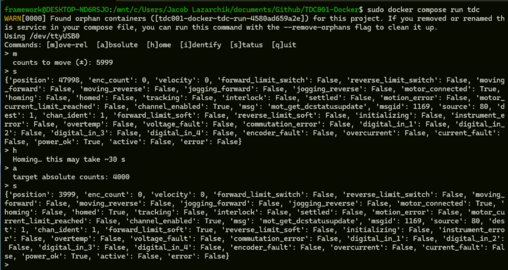

<!DOCTYPE html>
<html lang="en">
<head>
  <meta charset="UTF-8" />
</head>
<body>

<!-- Improved compatibility of back to top link -->

<!-- Shields -->

  
  
  
  
  

<!-- Project Title -->

  
  <h3 align="center">TDC001-Docker</h3>
  

    Dockerized FastAPI + Python control of the Thorlabs TDC001 Stepper Controller
     
    <a href="https://github.com/JacobGitz/TDC001-Docker"><strong>Explore the docs »</strong></a>
      
    <a href="https://github.com/JacobGitz/TDC001-Docker/issues">Report Bug</a>
    &middot;
    <a href="https://github.com/JacobGitz/TDC001-Docker/issues">Request Feature</a>
  

<!-- TOC -->
<h2>📑 Table of Contents</h2>
<ul>
  <li><a href="#about-the-project">About The Project</a></li>
  <li><a href="#built-with">Built With</a></li>
  <li><a href="#getting-started">Getting Started</a></li>
  <li><a href="#usage">Usage</a></li>
  <li><a href="#screenshots">Screenshots</a></li>
  <li><a href="#roadmap">Roadmap</a></li>
  <li><a href="#troubleshooting">Troubleshooting</a></li>
  <li><a href="#contributing">Contributing</a></li>
  <li><a href="#license">License</a></li>
  <li><a href="#contact">Contact</a></li>
</ul>

<!-- ABOUT -->
<h2 id="about-the-project">📦 About The Project</h2>

This project enables Python + FastAPI control of the Thorlabs TDC001 controller inside a fully Dockerized environment, compatible with Windows via WSL2 and USB/IP passthrough.

<strong>Docs(I suggest you read the presentation):</strong> 
- <a href="https://thorlabs-apt-device.readthedocs.io/en/latest/">APT Python Docs</a> 
- <a href="https://docs.google.com/presentation/d/1g8y-PXOg5V4Ve93i1UUEbFeU9zlJ3SWcqfPgaKH4Flg/edit?usp=sharing">"How To Docker #1" Presentation </a> (PDF Included in "/Docs" Directory) 
- Thorlabs Stepper Notes Doc (ask me for these)

<!-- BUILT WITH -->
<h2 id="built-with">🔧 Built With</h2>
<ul>
  <li>Python 3.11</li>
  <li>Docker / Docker Compose / Docker Desktop</li>
  <li>FastAPI</li>
  <li>PySerial</li>
  <li>thorlabs-apt-device</li>
  <li>usbipd-win (Windows USB passthrough)</li>
</ul>

<!-- GETTING STARTED -->
<h2 id="getting-started">🧪 Getting Started</h2>

<h3>Windows + WSL2 + Docker-Desktop Setup</h3>
<ol>
  <li>
    Download and install 
    <a href="https://www.docker.com/products/docker-desktop/" target="_blank">Docker Desktop</a> 
    for Windows. Follow the default installation process and ensure WSL2 integration is selected during setup.
  </li>
   
  <li>Open CMD & Install Fedora in WSL:
    <pre><code>wsl --install -d FedoraLinux-42</code></pre>
  </li>
   
  <li>Enable Fedora in Docker Desktop under:
    <b>Settings → Resources → WSL Integration</b>
  </li>
   
  <li>Set Fedora as Default Distro (Optional but Recommended):
    <pre><code>wsl --set-default FedoraLinux-42</code></pre>
    Now, if you type into CMD/PS:
    <pre><code>> wsl</code></pre> 
    It will automatically open  the Fedora terminal in WSL. 
    You Can Type <pre><code>$ exit</pre></code> to Exit 
    
<strong>Tip:</strong> With Fedora now integrated with Docker Desktop, you can run Docker CLI commands like <code>docker ps</code> or <code>docker run</code> directly from the Fedora WSL terminal.

      <a href="https://docs.docker.com/reference/cli/docker/" target="_blank" rel="noopener noreferrer">Docker CLI documentation</a>
  </li>
  <li>
    
Install <a href="https://github.com/dorssel/usbipd-win" target="_blank" rel="noopener noreferrer">usbipd-win</a> and bind a USB port to WSL using an elevated Command Prompt or PowerShell:

    <pre><code>usbipd list
usbipd wsl bind --busid=1-1  (or whatever one you want)</code></pre>
    
<strong>Notes:</strong>

    <ul>
      <li>Binding a <strong>USB port</strong> (bus ID) is <em>persistent</em>; it survives reboots.</li>
      <li>Attaching a <strong>USB device</strong> is <em>not persistent</em>; you must reattach it each time.</li>
      <li>Using a GUI can help automate USB device attachment.</li>
    </ul>
  </li>
   
  <li>Install an Optional <a href="https://gitlab.com/alelec/wsl-usb-gui">GUI</a> to Use usbipd-win easily and auto-attach devices
  </li>
</ol>

<h3>Clone + Docker-Compose: </h3>
<ol>
  <li>
    Clone the GitHub repository:
    <pre><code>> git clone https://github.com/JacobGitz/TDC001-Docker.git</code></pre>
    Or use the <a href="https://github.com/apps/desktop" target="_blank" rel="noopener noreferrer">GitHub Desktop app</a> for a graphical interface.
    This command downloads the full project including the pre-built Docker image and configuration files.
  </li>
   
  
  <li>
    Make sure you are in the main directory:
    <pre><code>> cd TDC001-Docker </code></pre>
    This is where the Dockerfile is, as well as our Docker image. 
  </li>
   
  <li>
    Enter Fedora terminal here:
    <pre><code>> wsl</code></pre>
  </li>
  <li>
    Start the Docker container using Docker Compose:
    <pre><code>$ sudo docker compose run tdc</code></pre>
    

    This command individually runs the "tdc" service inside the "docker-compose.yml" file. 
    It will automatically build the image and should pull up an interactive terminal window!
    

    <a href="https://docs.docker.com/compose/" target="_blank" rel="noopener noreferrer">Docker Compose Manual</a>
</ol>

<!-- USAGE -->
<h2 id="usage">🚀Other Usage</h2>
If you wish to run without Docker, you can (ensure you cd into the '/code' directory):
<pre><code>
> python(or python3) tdc001.py
$ python(or python3) tdc001.py (for linux)
</code></pre>

The script initializes, connects, and controls the TDC001 stepper.

<!-- SCREENSHOTS -->
<h2 id="screenshots">🖼️ Screenshots</h2>
<!--
Add screenshots to the <code>images/</code> directory and embed like:
 -->
<!-- <pre><code></code></pre> -->

<!-- ROADMAP -->
<h2 id="roadmap">🗺️ Roadmap</h2>
<ul>
  <li>[x] Docker runtime</li>
  <li>[x] USB/IP passthrough in WSL</li>
  <li>[x] Multi-controller support</li>
  <li>[ ] FastAPI backend</li>
  <li>[ ] PyQt frontend</li>
</ul>

<!-- TROUBLESHOOTING -->
<h2 id="troubleshooting">🧠 Troubleshooting</h2>
<table border="1">
<tr><th>Problem</th><th>Fix</th></tr>
<tr><td>TDC001() device not detected</td><td>Use usbipd to attach USB in WSL</td></tr>
<tr><td>No USB in Docker</td><td>Use <code>--privileged</code> in Docker or Compose</td></tr>
<tr><td>Anything Else</td><td>Copy & Paste Into ChatGPT</td></tr>
</table>

<!-- CONTRIBUTING -->
<h2 id="contributing">🤝 Contributing</h2>
<ol>
  <li>Fork this repo</li>
  <li>Create a new branch: <code>git checkout -b feature/foo</code></li>
  <li>Commit: <code>git commit -m "Add foo"</code></li>
  <li>Push: <code>git push origin feature/foo</code></li>
  <li>Submit me a pull request on Github</li>
</ol>

<!-- LICENSE -->
<h2 id="license">📜 License</h2>

GNU — see <code>LICENSE</code>

<!-- CONTACT -->
<h2 id="contact">📬 Contact</h2>

Jacob Lazarchik 
Email: <a href="mailto:lazarchik.jacob@gmail.com">lazarchik.jacob@gmail.com</a> 
GitHub: <a href="https://github.com/JacobGitz">@JacobGitz</a>

</body>
</html>
